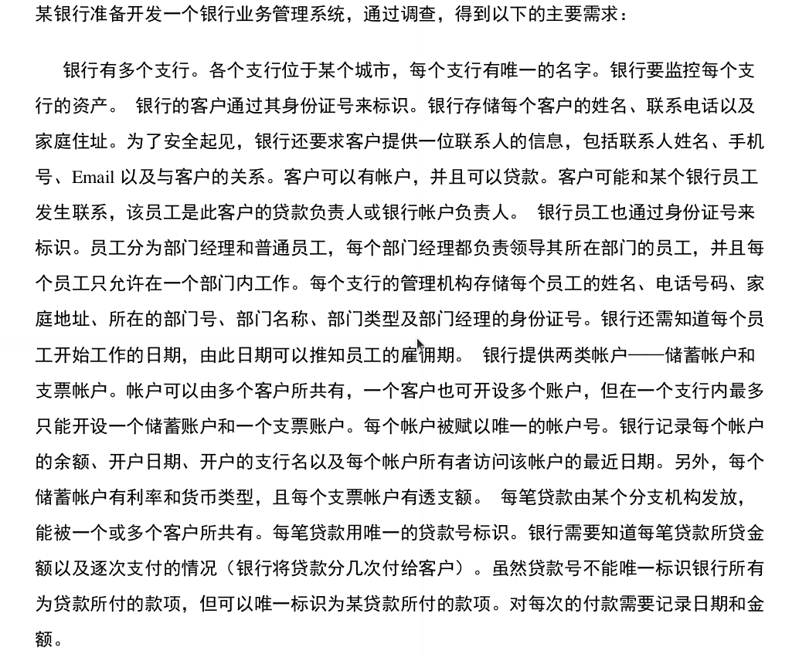
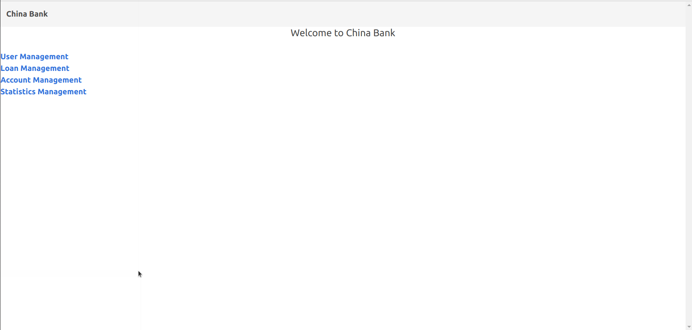

# 数据库lab3 实验报告
 PB18111679 范文

[toc]
## 1. 概述

### 1.1 系统目标

本次实验，我们希望开发出一个支持用户管理、账户管理、贷款管理和数据统计的银行管理系统。这个系统不仅可以完成需求的功能，而且拥有一个较为清晰，较易操作的用户界面。另外，最好还要加上一些异常处理，以加强程序的健壮性。

### 1.2 需求说明

本次实验的需求已经在lab2中给出了（如图1，2所示）



<div align = "center"> 图1 </div>


<div align = "center"> 图2 </div>  

简而言之，本次实验的需求就是在一个银行管理系统中，拥有银行的实体（如支行、部门、员工）以及用户的实体，还有他们之间产生交互关系的账户和贷款实体构成的一系列关系。

### 1.3 本报告的主要贡献

本次报告阐述了我是如何一步一步分析需求、建立模型、编码实现以及最终部署的。虽然没有工业级软件工程的流程，但我也基本实现了软件开发的基本流程。

## 2. 系统总体设计

### 2.1 系统模块结构

本次实验是在 `ubuntu 20.04` 的操作系统，`python 3.8.10` 和 `django 3.2.4` 的环境上执行的。根据需求分析以及 `django` 的框架的特点，我的程序主要模块结构如下所示。

```
├── apps
│   ├── account
│   │   ├── admin.py
│   │   ├── apps.py
│   │   ├── forms.py
│   │   ├── __init__.py
│   │   ├── migrations
│   │   ├── models.py
│   │   ├── tests.py
│   │   ├── urls.py
│   │   └── views.py
│   ├── core
│   │   ├── admin.py
│   │   ├── apps.py
│   │   ├── migrations
│   │   ├── templates
│   │   │   ├── account
│   │   │   │   ├── check
│   │   │   │   │   ├── check_append.html
│   │   │   │   │   ├── check_profile.html
│   │   │   │   │   └── check_update.html
│   │   │   │   ├── deposit
│   │   │   │   │   ├── deposit_append.html
│   │   │   │   │   ├── deposit_profile.html
│   │   │   │   │   └── deposit_update.html
│   │   │   │   └── overview.html
│   │   │   ├── base.html
│   │   │   ├── home.html
│   │   │   ├── loan
│   │   │   │   ├── append.html
│   │   │   │   ├── overview.html
│   │   │   │   └── profile.html
│   │   │   ├── statistics
│   │   │   │   ├── business
│   │   │   │   │   ├── by_account.html
│   │   │   │   │   └── by_loan.html
│   │   │   │   ├── overview.html
│   │   │   │   └── time
│   │   │   │       ├── by_month.html
│   │   │   │       ├── by_season.html
│   │   │   │       └── by_year.html
│   │   │   ├── style.css
│   │   │   └── user
│   │   │       ├── append.html
│   │   │       ├── overview.html
│   │   │       ├── profile.html
│   │   │       └── update.html
│   │   ├── tests.py
│   │   └── views.py
│   ├── fixtures
│   │   ├── all_data.json
│   │   ├── init_data.json
│   │   └── new_data.json
│   ├── loan
│   │   ├── admin.py
│   │   ├── apps.py
│   │   ├── forms.py
│   │   ├── migrations
│   │   ├── models.py
│   │   ├── tests.py
│   │   ├── urls.py
│   │   └── views.py
│   ├── statistics
│   │   ├── admin.py
│   │   ├── apps.py
│   │   ├── models.py
│   │   ├── tests.py
│   │   ├── urls.py
│   │   └── views.py
│   ├── subbank
│   │   ├── admin.py
│   │   ├── apps.py
│   │   ├── migrations
│   │   ├── models.py
│   │   ├── tests.py
│   │   └── views.py
│   └── user
│       ├── admin.py
│       ├── apps.py
│       ├── forms.py
│       ├── migrations
│       ├── models.py
│       ├── tests.py
│       ├── urls.py
│       └── views.py
├── bank
│   ├── asgi.py
│   ├── __init__.py
│   ├── settings.py
│   ├── urls.py
│   └── wsgi.py
├── db.sqlite3
└── manage.py
```

在这里，不同模块的功能介绍如下：
* `bank`: 银行的总模块，里面的 `settings.py` 存放了实验的模块调用配置、`urls.py` 存放了实验的根 `url` 的配置。
* `apps.user`: 用户模块，用来实现对用户信息的增、删、改、查。
* `apps.subbank`: 分行模块，里面有分行、部门、员工的的信息。
* `apps.loan`: 贷款模块，用来实现对贷款信息的增、删、改、查。
* `apps.account`: 账户模块，用来实现对存储账户和支票账户的增、删、改、查。
* `apps.core`: 核心模块，主要用来存放前端的 `html` 文件。

### 2.2 系统工作流程

由于我是使用 `django` 的 `BS` 架构，且后端在本台主机上运行，因此系统工作流程如下：

* 首先，用户往浏览器发出 `http post` 请求；
* 接着，浏览器通过 `LAN` 把请求传递给本地服务器运行的程序；
* 本地服务器运行的程序把这些请求传递给数据库；
* 数据库得到相应的结果，并通过类似的方式将其返回给浏览器。

### 2.3 数据库设计

由 lab2 中的实现可知，`E-R`模型如图3所示。


<div align = "center"> 图3 </div>  

其生成的物理模型如图4所示。


<div align = "center"> 图4 </div> 

但是，我发现使用 `django` 的时候，可以使用 `ManyToManyField` 来解决用户与账户之间的多对多关系，并且使用 `python` 来对其进行约束判断（这样比存储过程安全）。

## 3. 详细设计

以下，我将分模块介绍我的实现

### 3.1 `apps.user` 模块

这是用户模块，用来对用户的信息进行增、删、改、查。

#### 3.1.1 `User` 用户模块
其中， 描述银行用户的 `User` 模块如下：

``` python
# apps/user/models.py

# the model of User in a bank
class User(models.Model):
    ID = models.CharField(max_length = 20, primary_key = True)
    Name = models.CharField(max_length = 255)
    PhoneNum = models.CharField(max_length = 20)
    Address = models.CharField(max_length = 255)
    Contact_Name = models.CharField(max_length = 255)
    Contact_PhoneNum = models.CharField(max_length = 20)
    Contact_Email = models.EmailField()
    def __str__(self):
        return self.ID
```

#### 3.1.2 `UserAppendView` 用户添加
为了完成用户的添加，我写了一个用户添加表格 `UserAppendForm`，覆盖了用户的所有属性。（如下所示）

``` python
# apps/user/forms.py

# the form to record the info to append user
# requires: User,ModelForm
class UserAppendForm(forms.ModelForm):
    
    # the User model
    class Meta:
        model = User
        fields = ( 'ID', 'Name', 'PhoneNum', 'Address', \
        'Contact_Name', 'Contact_PhoneNum', 'Contact_Email' )

    # save this form
    def save(self, commit = True):
        # Save the provided password in hashed format
        user = super().save(commit = False)
        if commit:
            user.save()
        return user
```

然后，用户添加模块就可以这么写了。里面添加了对表项内容的判断。如果一个用户  `ID` 已经在数据库中存在了，那么这个添加是无效的。

``` python
# apps/user/views.py

# for appending user
# requires: CreateView, User, reverse
class UserAppendView(CreateView):

    template_name = 'user/append.html'
    model = User
    fields = ['ID', 'Name', 'PhoneNum', 'Address', \
        'Contact_Name', 'Contact_PhoneNum', 'Contact_Email']
    
    # after success, redirect to overview
    def get_success_url(self):
        return reverse('user:overview')

    # save the data when the submitted form is valid
    def form_valid(self, form):
        user = form.save(commit = False)
        user.save()
        return super().form_valid(form)

    # show the error when the submitted form is invalid
    def form_invalid(self, form):
        cleaned_form = form.cleaned_data
        # check if the user ID already exists
        if 'ID' not in cleaned_form:
            return HttpResponse("Loan ID already exists in the form")
        else:
            return HttpResponse("form is invalid for other errors")
```

#### 3.1.3 `UserProfileView` 特定用户信息显示

当前端需要显示某一个用户的信息的时候，会当向后端发出 `http post` 请求并传送 `user.ID` 。后端会调用 `get_context_data()` 方法，根据得到的 `user.ID`，将从数据库得到的 `user` 记录通过 `context` 返回给 `django` 引擎，进而传递给前端。

``` python
# apps/user/views.py

# for showing profile of a particular user
# requires DetailView, User
class UserProfileView(DetailView):
    template_name = 'user/profile.html'
    model = User

    # get the particular user record
    # according to the received pk
    def get_context_data(self, **kwargs):
        context = super(UserProfileView, self).get_context_data(**kwargs)
        user_id = self.object.pk
        context['user'] = User.objects.get(ID = user_id)
        return context
```

#### 3.1.4 `UserProfileUpdateView` 特定用户信息更新

这里用于更新用户的信息。相比于添加用户，这里我调用了 `crispy_forms` 来修改信息。其中`form_valid()` 方法可以将表格中的数据组织成一个记录，并保存在数据库中。

``` python
# apps/user/views.py

# for updating a user profile
# requires UpdateView, User, reverse
class UserProfileUpdateView(UpdateView):
    template_name = 'user/update.html'
    model = User
    fields = [ 'Name', 'PhoneNum', 'Address', 'Contact_Name',\
             'Contact_PhoneNum', 'Contact_Email']

    # get the particular user record
    # according to the received pk
    def get_context_data(self, **kwargs):
        context = super(UserProfileUpdateView, self).get_context_data(**kwargs)
        user_id = self.object.pk
        context['user'] = User.objects.get(ID = user_id)
        return context

    # the url after successful operation
    def get_success_url(self):
        return reverse('user:overview')
    
    # save the data
    def form_valid(self, form):
        user = form.save(commit = False)
        user.save()
        return super().form_valid(form)
```

#### 3.1.5 `UserDelete` 特定用户删除

这里，我自己写了一个函数 `UserDelete`, 用来删除某一个用户。后端通过得到前端传来的 `user_ID`,在数据库中找到这条记录并进行删除。在删除之前，判断这个用户是否拥有贷款和账户。如果有，则删除失败。

``` python
# apps/user/views.py

# for deleting a user
# we need to check whether the user has a account or loan,
# if so, we can't delete it
# @request: the HTTP request
# @user_ID: the primary key of a user
def UserDelete(request, user_ID):
    # get the selected loan from its loan_ID and its remaining money
    user = User.objects.get(ID = user_ID)

    # for http post request, check whether delete to delete the user
    if request.method == 'POST':
        loans = Loan.objects.filter(User = user)
        deposit_accounts = DepositAccount.objects.all()
        check_accounts = CheckAccount.objects.all()
        # 1. check whether the user owns a loan
        if loans:
            return HttpResponse("the user %s %s has owned a loan" %(user.ID, user.Name) )
        # 2. check whether the user has a deposit account
        for deposit_account in deposit_accounts:
            deposit_account_users = deposit_account.Users.all()
            if user in deposit_account_users:
              return HttpResponse("the user %s %s has owned a deposit account" %(user.ID, user.Name) )
        
        # 3. check whether the user has a check account
        for check_account in check_accounts:
            check_account_users = check_account.Users.all()
            if user in check_account_users:
               return HttpResponse("the user %s %s has owned a check account" %(user.ID, user.Name) )

        # 4. no problem, just delete the user
        User.objects.filter(ID = user_ID).delete()
        return HttpResponseRedirect(reverse('user:overview'))
    else:
        return HttpResponseRedirect(reverse('user:overview'))
```

### 3.2 `apps.subbank` 模块

#### 3.2.1 `Subbank` 支行模块

根据物理模型，可以写出支行的模块如下所示：

``` python
# apps/subbank/models.py

# the entity of a department in a subbank
class Department(models.Model):
    ID = models.CharField(max_length = 20,primary_key = True)
    Name = models.CharField(max_length = 255)
    Type = models.CharField(max_length = 20)
    Leader_ID = models.CharField(max_length = 20)
    Subbank = models.ForeignKey(Subbank, \
        related_name = 'belongs_to',on_delete = models.CASCADE)

    def __str__(self):
        return self.ID
```

#### 3.2.2 `Department` 部门模块

根据物理模型，可以写出部门的模块如下所示：

``` python
# apps/subbank/models.py

# the entity of a department in a subbank
class Department(models.Model):
    ID = models.CharField(max_length = 20,primary_key = True)
    Name = models.CharField(max_length = 255)
    Type = models.CharField(max_length = 20)
    Leader_ID = models.CharField(max_length = 20)
    Subbank = models.ForeignKey(Subbank, \
        related_name = 'belongs_to',on_delete = models.CASCADE)

    def __str__(self):
        return self.ID
```

这里用一个 `Leader_ID` 属性来记录领导，而不是对 `Employee` 使用外键，否则会造成循环参照。

#### 3.2.3 `Employee` 员工模块

根据物理模型，可以写出员工的模块如下所示：

``` python
# apps/subbank/models.py

# the entity of an employee in a department
# each employee has a unique ID
# and has a Department_ID of the department that he/she works for
class Employee(models.Model):
    ID = models.CharField(max_length = 20,primary_key = True)
    Name = models.CharField(max_length = 255)
    PhoneNum = models.CharField(max_length = 20)
    Address = models.CharField(max_length = 255)
    StartDate = models.DateTimeField(auto_now_add = True)
    Depart = models.ForeignKey(Department, \
        related_name = 'works_for',on_delete = models.CASCADE)

    def __str__(self):
        return self.ID
```

### 3.3 `apps.loan` 模块

#### 3.3.1 `Loan` 贷款模块

根据物理模型，可以得到 `Loan` 的模块如下所示：

``` python
# apps/loan/models.py

## the entity of loan
class Loan(models.Model):
    ID = models.CharField(max_length = 20, primary_key = True)
    # the Loan is issued by a Subbank
    Subbank = models.ForeignKey(
        Subbank, 
        related_name = 'Loan_issued_by_Subbank',
        on_delete = models.CASCADE
    )
    Money = models.DecimalField(max_digits = 20, decimal_places = 2)
    # the Loan is owned by a User
    User = models.ForeignKey(
        User,
        related_name = 'Loan_owned_by_User',
        on_delete = models.CASCADE,
        null = True
    )
    CreatedDate = models.DateField(null = True, blank = True)
    # the Loan is managed by a bank employee
    Manager = models.ForeignKey(
        Employee,
        related_name = "Loan_managed_by_Employee",
        on_delete = models.CASCADE,
        null = True
    )

    def __str__(self):
        return self.ID

    class Meta:
        ordering = ['-CreatedDate']

```

这里使用外键引用了 `Subbank`、`User` 和 `Employee` 模块。

#### 3.3.2 `Payment` 支付模块

根据物理模型，可以让 `Payment` 支付模块的外键引用 `Loan`，得到了如下模块：

``` python
# apps/loan/models.py

# the entity of payment
class Payment(models.Model):
    # Payment pays for a Loan
    Loan = models.ForeignKey(
        Loan, 
        related_name = 'Payment_pays_for_Loan',
        on_delete = models.CASCADE
    )
    PayDate = models.DateField(null = True, blank = True)
    PayMoney = models.DecimalField(max_digits = 20, decimal_places = 2)
    
    class meta:
        ordering = ['-PayDate']
```

#### 3.3.3 `LoanPay` 支付贷款

由于贷款添加 `LoanAppendView`, 贷款信息显示 `LoanProfileView` 和用户模块中的方法类似，因此我就不一一列举了。下面考虑支付贷款的方法 `LoanPay`。

首先，要通过前端传递的贷款号 `loan_ID`,得到这个贷款记录。其次，获取前端传来的表，并得到其中的 `money`,作为支付的钱。如果 `money` 小于0 或者 `money` 大于贷款额，那么还款无效。若还款有效，则修改对应贷款 `loan` 的值并保存。

``` python
# # apps/loan/views.py

# for paying back the money for a loan
# @request: the HTTP request
# @loan_ID: the primary key of a loan
# note that the pay_money should <= remain money in loan
def LoanPay(request, loan_ID):
    # get the selected loan from its loan_ID and its remaining money
    loan = get_object_or_404(Loan, pk = loan_ID)
    remain_money = loan.Money
    # for http post request, send the data to back end
    if request.method == 'POST':
        # get the transmitted form
        form = MoneyForm(request.POST)
        print(form)
        if form.is_valid:
            # get the pay_money from front end
            form_set = form.cleaned_data
            pay_money = form_set['PayMoney']
            # pay_money < 0, invalid input
            if pay_money < 0:
                return render(request, 'loan/profile.html', {
                    'loan': loan,
                    'error_message': "pay money cannot be negative",
                })
            # pay too much money, also invalid
            elif(pay_money > remain_money):
                return render(request, 'loan/profile.html', {
                    'loan': loan,
                    'error_message': "pay money cannot be more than remain_money",
                })
            # successfully pay back the loan, go back to loan page
            else:
                # insert a new payment record
                payment = Payment(Loan = loan, \
                        PayDate = timezone.now(), PayMoney = pay_money)
                payment.save()
                # also save the revised loan record
                loan.Money = loan.Money - pay_money
                loan.save()
                return HttpResponseRedirect(reverse('loan:profile', args = (loan_ID,)))
    else:
        form = MoneyForm()
        return HttpResponseRedirect(reverse('loan:profile', args = (loan_ID,)))
```

#### 3.3.4 `LoanDelete` 删除贷款

基本原理和支付贷款是类似的，就是要判断贷款额是否为0。只有当贷款额为0的时候才能删除这个贷款。

``` python
# apps/loan/views.py

# for deleting a loan
# @request: the HTTP request
# @loan_ID: the primary key of a loan
def LoanDelete(request, loan_ID):
    # get the selected loan from its loan_ID and its remaining money
    loan = get_object_or_404(Loan, pk = loan_ID)
    remain_money = loan.Money
    # for http post request, check whether delete the loan
    if request.method == 'POST':
        # there is still some debt in the loan, we cannot delete it
        if remain_money > 0:
            return render(request, 'loan/profile.html', {
                'loan': loan,
                'error_message': \
                    "fail to delete due to the existence of remaining money",
            })
        # no debt in the loan, so we can delete it and redirect to homepage
        else:
            Loan.objects.filter(pk = loan_ID).delete()
            return HttpResponseRedirect(reverse('loan:overview'))
    else:
        return HttpResponseRedirect(reverse('loan:overview'))
```

### 3.4 `apps.account` 模块


#### 3.4.1 `AccountBase` 账户父类模块

根据需求分析，由于储蓄账户和支票账户享有较多相同的属性，所以可以先构造一个基类模型 `AccountBase`。在 `AccountBase` 中，需要外键引用 `Subbank`和 `Manager`。另外，由于账户和用户拥有多对多的关系，因此我使用了

``` python
Users = models.ManyToManyField(User)
``` 

来表示这一关系。对于一个用户只能在一个支行最多开一个储蓄账户和一个支票账户的约束，则可以在后端使用 `python`查找统计来实现。

``` python
# apps/account/models.py

# the base entity of Account
# account has two types: deposit_account and check_account
# note that an account can be shared by multiple clients
# one client can at most have one deposit_account and one check_account
# in one subbank
class AccountBase(models.Model):
    ID = models.CharField(max_length = 20, primary_key = True)
    # the AccountBase is issued by a Subbank
    Subbank = models.ForeignKey(
        Subbank,
        on_delete = models.CASCADE,
        null = True
    )
    # The many-to-many key of User
    Users = models.ManyToManyField(User)
    
    Money = models.DecimalField(max_digits = 20, decimal_places = 2)
    RegDate = models.DateTimeField(null = True)
    
    # the Account is managed by a bank employee
    Manager = models.ForeignKey(
        Employee,
        on_delete = models.CASCADE,
        null = True
    )

    class Meta:
        abstract = True
        ordering = ['-RegDate']

    def __str__(self):
        return self.ID
```

#### 3.4.2 `DepositAccount` 储蓄账户 和 `CheckAccount` 支票账户模块

`DepositAccount` 和 `CheckAccount` 只需要继承 `AccountBase` 模块，并添加单独的属性即可。

``` python
# apps/account/models.py

# the entity of deposit account, which inherit the base account
class DepositAccount(AccountBase):
    InterestRate = models.DecimalField(max_digits = 5, decimal_places = 2)
    # here we only have two choices of currency
    CurrencyType = models.IntegerField(choices = \
        (   (1, 'RMB'),  \
            (2, 'US DOLLAR') ) )


# the entity of check account, which inherit the base account
class CheckAccount(AccountBase):
    OverDraft = models.DecimalField(max_digits = 20, decimal_places = 2)
```

#### 3.4.3 `DepositAccountAppendView` 储蓄账户添加模块

这里的执行框架和之前的用户添加模块类似。只是在方法 `form_valid()` 中， 会从表格中得到这个账户的所在支行和所有用户，并判断这些用户是否在这个支行中有储蓄账户。 如果有的话，则添加无效。否则往数据库中添加新的记录。

``` python
# apps/account/views.py

# for appending deposit account
# requires: CreateView, User, reverse
class DepositAccountAppendView(CreateView):

    template_name = 'account/deposit/deposit_append.html'
    model = DepositAccount
    form_class = DepositAccountAppendForm
    
    # after success, redirect to home first
    def get_success_url(self):
        return reverse('account:overview')

    # save the data when the submitted form is valid
    def form_valid(self, form):
        # get the users, subbank and money
        deposit_account = form.save(commit = False)
        users = form.cleaned_data['Users']
        subbank = deposit_account.Subbank
        money = deposit_account.Money
        interetst_rate = deposit_account.InterestRate
        # 1. check if a user already has a deposit account in the same subbank
        for user in users:
            deposit_account_set = DepositAccount.objects.all()
            for each_deposit_account in deposit_account_set:
                if each_deposit_account.Subbank == subbank:
                    each_deposit_account_users = each_deposit_account.Users.all()
                    if user in each_deposit_account_users:
                        return HttpResponse("the user %s %s has owned a deposit account in %s subbank" %(user.ID, user.Name, subbank.Name) )
        # 2. check if the money is negative
        if money < 0:
            return HttpResponse("the money in a deposit account should not be negative")
        # 3. check if the interest rate is negative
        elif interetst_rate < 0:
            return HttpResponse("the interest rate should not be negative")
        # no problem, save the deposit account
        # and the change the asset of the subbank
        else:
            subbank.Asset = subbank.Asset + deposit_account.Money
            subbank.save()
            deposit_account.save()
            for user in users:
                deposit_account.Users.add(user)
            deposit_account.save()
            return super().form_valid(form)

    # show the error when the submitted form is invalid
    def form_invalid(self, form):
        cleaned_form = form.cleaned_data
        # check if the loan ID already exists
        if 'ID' not in cleaned_form:
            return HttpResponse("Account ID already exists in the form")
```

其余的 `DepositAccountProfileView`、`DepositAccountUpdateView`、`DepositAccountDelete` 类或者方法的实现方式也类似。同时，对于支票账户 `CheckAccount` 的函数和方法的实现也类似，就不再赘述了。

### 3.5 `apps.statistics` 统计模块

#### 3.5.1 `StatisticsByLoanView` 按贷款量统计

根据需求可知， 我们可以在后端得到每一个支行 `subbank` 的贷款数目、贷款金额以及贷款用户数，因此得到了3个列表 `total_amount`, `total_money` 和 `total_user_num`。然后，使用 `zip` 函数将它们与 `Subbank` 的 `queryset` 一起打包进 `context` 中，最终返回给前端。

``` python
# apps/statistics/views.py

# for showing the statistics of subbanks by loan
# requires: ListView, Subbank, Loan
class StatisticsByLoanView(ListView):
    template_name = 'statistics/business/by_loan.html'
    model = Subbank
    
    # get the amount and total money of loans of each subbank
    def get_context_data(self, **kwargs):
        context = super(StatisticsByLoanView, self).get_context_data(**kwargs)
        # get the wholeset of subbanks and loans
        subbanks = Subbank.objects.all()
        loans = Loan.objects.all()
        # they store the total amount and money of loans 
        # and the corresponding total amount of users of each subbank  
        total_amount = []
        total_money = []
        total_user_num = []
        # get the total loan amount and loan money for each subbank
        for subbank in subbanks:
            amount = 0
            money = 0
            users = set({})
            for loan in loans:
                if loan.Subbank == subbank:
                    amount += 1
                    money += loan.Money
                    users.add(loan.User)

            total_amount.append(amount)
            total_money.append(money)
            total_user_num.append( len(users) )
        # pack them together and send them back to the front end
        all_info = zip(subbanks, total_amount, total_money, total_user_num)
        context['all_info'] = all_info
        return context
```

同理，按存储账户来统计也可以类似地实现。


#### 3.5.2 `StatisticsByYearView` 按年统计

对每一个支行对象 `subbank`, 计算出一个列表，里面有12个元素，每个元素包含3个域：业务数量 `amount`，业务总额 `money` 以及业务用户数量 `user_num`。在计算的时候，遍历所有的储蓄账户和贷款，并对这个支行发放的储蓄账户或者贷款按照其注册的年份进行统计记录。因此代码如下所示：

``` python
# apps/statistics/views.py

# for showing the statistics of subbanks by year
# requires: ListView, Subbank, Loan, DepositAccount
class StatisticsByYearView(ListView):
    template_name = 'statistics/time/by_year.html'
    model = Subbank
    
    # the class of a triple of basic info of a subbank in a year
    class InfoTriple(object):
        amount = 0
        money = 0
        user_num = 0
        def __init__(self, amount, money, user_num):
            self.amount = amount
            self.money = money
            self.user_num = user_num
 
    # get the amount, total money and user number of business of each subbank
    def get_context_data(self, **kwargs):
        context = super(StatisticsByYearView, self).get_context_data(**kwargs)
        # get the wholeset of subbanks, loans and accounts
        subbanks = Subbank.objects.all()
        deposit_accounts = DepositAccount.objects.all()
        loans = Loan.objects.all()
        # count the years 2015 ~2021
        year_num = 7
        year_list = [1] * year_num
        for i in range(year_num):
            year_list[i] = i + 2015
        # they store the total amount and money of business
        # and the number of their coresponding users of each subbank  
        total_info = []
        # get the total business amount and money 
        # and user number for each subbank
        for subbank in subbanks:
            # for each subbank
            each_info = dict()
            each_users = dict()
            for i in year_list:
                each_info[i] = self.InfoTriple(0,0,0)
                each_users[i] = set({})

            # count the loan of each year
            for loan in loans:
                if loan.Subbank == subbank:
                    year = loan.CreatedDate.year
                    # count the business amount
                    each_info[year].amount += 1
                    # count the business money
                    each_info[year].money += loan.Money
                    # count the user number
                    each_users[year].add(loan.User)

            # count the deposit accounts of each year
            for deposit_account in deposit_accounts:
                if deposit_account.Subbank == subbank:
                    year = deposit_account.RegDate.year
                    # count the business amount
                    each_info[year].amount += 1
                    # count the business money
                    each_info[year].money += deposit_account.Money
                    # count the user number
                    each_users[year].add(deposit_account.Users.all())


            # save the result of one subbank
            for i in year_list:
                each_info[i].user_num = len(each_users[i])
            total_info.append(each_info)

        # pack them together and send them back to the front end
        all_info = zip(subbanks, total_info)
        context['all_info'] = all_info
        return context
```

因此，按月实现和按季度实现的方法也类似。

## 4. 实现与测试

以下，我给出了我的实现和测试。

### 4.1 主页

银行系统的主页在 [localhost:8000](localhost:8000) 中，

在 `django` 主目录下运行

```
python3 manage.py runserver
```

得到了效果如图5所示。

<div align = "center"> 图5 </div> 

### 4.2 用户

#### 4.2.1 用户总览

用户的总览页面在 [localhost:8000/user](localhost:8000/user) 中。这里我使用 `admin` 预先插入了几个客户，得到了页面如图6所示。


<div align = "center"> 图6 </div> 

这里给出了每一个用户的最基本的信息，以及添加用户、查看用户信息、修改用户信息以及删除用户信息的选项。

#### 4.2.2 添加用户

在用户总览页面上点击 `append a user` 按钮,跳转到添加用户的页面 [localhost:8000/user/append](localhost:8000/user/append) 中。得到的效果如图7所示。


<div align = "center"> 图7 </div> 

这里可以提供了输入文本和勾选的地方，方便输入。

#### 4.2.3 查看用户

在用户总览页面上点击某个用户的 `View profile` 按钮。跳转到用户查看页面 [localhost:8000/user/profile/user.ID](localhost:8000/user/profile/user.ID) 中。得到的效果如图8所示。


<div align = "center"> 图8 </div> 

这里以一个表格的形式，返回这个用户的详细信息。

#### 4.2.4 更新用户

在用户总览页面上点击某个用户的 `Update profile` 按钮。跳转到更新用户页面 [localhost:8000/user/profile/user.ID](localhost:8000/user/update/user.ID) 中。得到的效果如图9所示。


<div align = "center"> 图9 </div> 

这里以一个表格的形式，便于用户输入。另外，用户的 `ID` 是无法修改的，这符合场景需求。

#### 4.2.5 删除用户

在用户总览页面上点击某个用户的 `delete` 按钮。如果删除成功，跳转
到用户总览页面 [localhost:8000/user](localhost:8000/user) 中；如果删除失败，则跳转到删除页面 [localhost:8000/user/delete/user.ID](localhost:8000/user/delete/user.ID),得到的效果如图10所示。


<div align = "center"> 图10 </div> 

由于要删除的用户拥有贷款，因此这个删除失败。

### 4.3 贷款

#### 4.3.1 贷款总览

贷款的总览页面在 [localhost:8000/loan](localhost:8000/loan) 中。这里我使用 `admin` 预先插入了2个贷款，得到了页面如图11所示。


<div align = "center"> 图11 </div> 

这里给出了每一个贷款的最基本的信息，以及添加贷款和查看贷款信息的选项。

#### 4.2.2 添加贷款

在贷款总览页面上点击 `append a loan` 按钮,跳转到添加用户的页面 [localhost:8000/loan/append](localhost:8000/loan/append) 中。得到的效果如图12所示。


<div align = "center"> 图12 </div> 

这里可以提供了输入文本和勾选的地方，方便输入。

#### 4.2.3 查看贷款

在贷款总览页面上点击某个账户的 `View detail` 按钮。跳转到贷款查看页面 [localhost:8000/loan/profile/loan.ID](localhost:8000/loan/profile/loan.ID) 中。得到的效果如图13所示。


<div align = "center"> 图13 </div> 

这里以一个表格的形式，返回这个用户的详细信息。

#### 4.2.4 支付贷款

在贷款查看页面上的 `pay back loan` 中写入支付金额，点击 `submit` 按键。则可以完成一次支付，并且得到了支付记录（如图14所示）。


<div align = "center"> 图14 </div> 

#### 4.2.5 删除贷款

在贷款查看页面上不断支付，直至贷款剩余为0，则可以删除此贷款（如图15所示），并且跳回到贷款总览页面上。


<div align = "center"> 图15 </div> 


### 4.3 账户

#### 4.3.1 账户总览

账户的总览页面在 [localhost:8000/account](localhost:8000/account) 中。这里我使用 `admin` 预先插入了2个储蓄账户和2个支票账户，得到了页面如图16所示。


<div align = "center"> 图16 </div> 

这里给出了每一个账户的最基本的信息，以及添加账户、查看账户信息和删除账户的选项。

#### 4.3.2 添加账户

在贷款总览页面上点击 `append a deposit account` 按钮,跳转到储蓄账户的页面 [localhost:8000/account/deposit-append](localhost:8000/account/deposit-account) 中。得到的效果如图17所示。


<div align = "center"> 图17 </div> 

这里可以提供了输入文本和勾选的地方，方便输入。支票账户也是类似的。

#### 4.2.3 查看账户信息

在账户总览页面上点击某个账户的 `View detail` 按钮。跳转到账户查看页面 [http://localhost:8000/account/deposit-profile/deposit_account.ID](http://localhost:8000/account/deposit-profile/deposit_account.ID) 中。得到的效果如图18所示。


<div align = "center"> 图18 </div> 

这里以一个表格的形式，返回这个用户的详细信息。

#### 4.2.4 修改账户

在账户总览页面上点击 `Update account`, 则跳转进入账户修改页面进行修改（如图19所示）。


<div align = "center"> 图19 </div> 

#### 4.2.5 删除账户

在账户总览页面上点击 `delete`, 则可对账户进行删除，成功后跳转回账户总览页面。

### 4.4 统计

#### 4.4.1 按贷款统计

在统计主页面 [localhost:8000/statistics](localhost:8000/statistics) 中, 点击 `By loan`，得到了按照贷款统计的每一个支行的贷款信息，包括贷款数量、贷款金钱和贷款用户数目（如图20所示）。


<div align = "center"> 图20 </div> 

#### 4.4.2 按储蓄账户统计

类似 4.4.1，在统计主页面 [localhost:8000/statistics](localhost:8000/statistics) 中, 点击 `By account`，得到了按照储蓄账户统计的每一个支行的储蓄账户信息，包括储蓄账户数量、储蓄账户金钱和储蓄账户用户数目（如图21所示）。


<div align = "center"> 图21 </div> 

#### 4.4.3 按年统计

在统计主页面 [localhost:8000/statistics](localhost:8000/statistics) 中, 点击 `By year`，得到了按照年份统计的每一个支行的业务信息，包括业务数量、业务金钱和业务用户数目（如图22所示）。


<div align = "center"> 图22 </div> 

#### 4.4.4 按月统计

类似 4.4.3, 在统计主页面 [localhost:8000/statistics](localhost:8000/statistics) 中, 点击 `By month`，得到了按照月份统计的每一个支行的业务信息，包括业务数量、业务金钱和业务用户数目（如图23所示）。


<div align = "center"> 图23 </div> 

#### 4.4.5 按季度统计

类似 4.4.3, 在统计主页面 [localhost:8000/statistics](localhost:8000/statistics) 中, 点击 `By season`，得到了按照季度统计的每一个支行的业务信息，包括业务数量、业务金钱和业务用户数目（如图24所示）。


<div align = "center"> 图24 </div> 

## 5. 总结与讨论

### 总结:

本次实验，我使用了 `BS` 架构和 `django` 框架，从概念模式设计开始，逐步搭建了一个简单的银行系统。这个银行系统可以完成需求上的功能，还能对异常的输入进行异常响应（即具有一定的健壮性）。也通过这一次实验，我更加熟悉了软件开发的流程。然而，本次实验也给了我一个教训，就是要加强与别人的交流，不能单纯按照自己的设想进行设计。（我刚开始以为这是一个面向用户而非管理员的银行系统，因此做了很多用户注册登录的工作，走了很多弯路）

### 讨论：

* 本次实验由于时间紧张，没有做很多测试样例，这是一个缺点。

* 另外，我放弃了最初由 `E-R` 图得到的物理模型，而是使用了 `django` 的 `ManyToManyField`，这样可以更加简化模型。

* 此外，我在统计数据的时候，是选择在后端进行统计计算，再把统计结果发送到前端。前端只需要把结果展示出来就行了。因此，把主要的计算放在后端，这是符合一般场景的。 